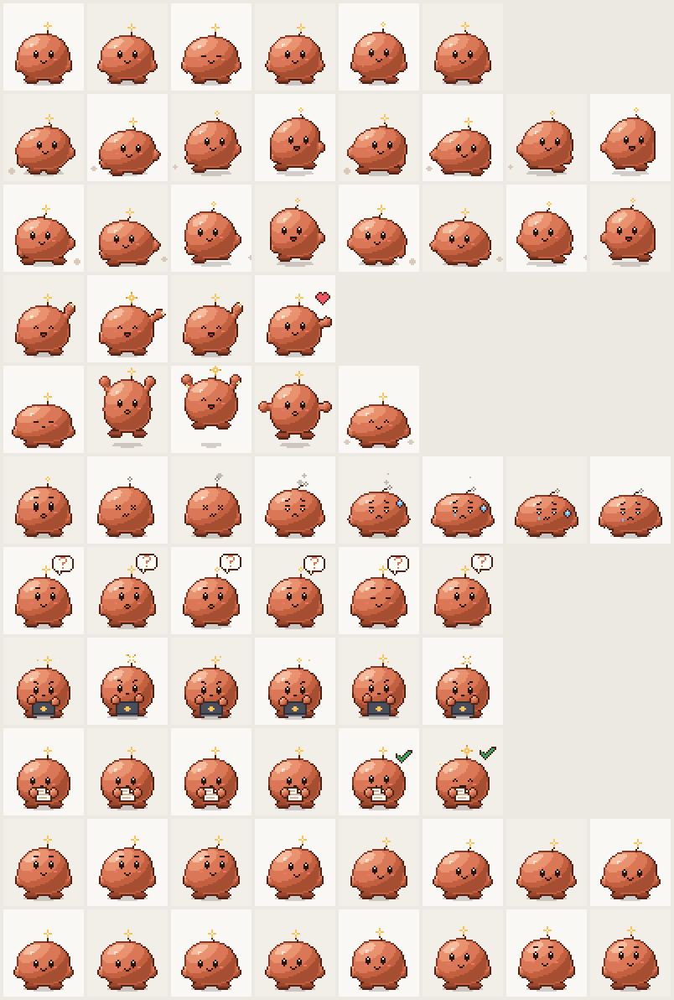

# Claude Pet

A small animated companion that floats above your windows and shows what your
Claude desktop **Code** sessions are doing, and your **Codex** threads too. It works like the
Pets feature in the ChatGPT/Codex desktop app and uses the same pet format, so ChatGPT/Codex
pets work here too.



## Run it

```bash
npm install
npm start          # the pet appears in the bottom-right corner, plus a tray icon
npm run demo       # cycles through every status with fake sessions
npm test           # unit tests for the status logic
npm run shortcut   # creates "Claude Pet.lnk" in this folder (Windows)
node src/sessions.js   # print what the pet currently sees, then exit
```

To start it without a console window, double-click **Claude Pet.lnk** in this folder, or turn on
*Start at login* in the tray menu. The flags `--start-at-login` and `--no-start-at-login` set
the same option from the command line. `Ctrl+Alt+P` shows or hides the pet. Right-click the pet
(or click the tray icon) for the menu.

## What the pet tells you

| Pet animation | Bubble        | Meaning |
| ------------- | ------------- | ------- |
| waiting       | **Needs you** | Claude asked a question, has a plan waiting for approval, or ended its turn waiting on a decision from you |
| failed        | **Error**     | The turn ended with an API error |
| review        | **Ready**     | A turn finished and you haven't opened that session since |
| running       | **Running**   | Claude is working |
| idle          | none          | Nothing to report |

Every active session gets its own bubble, most urgent first, in the same order as ChatGPT's pet:
Needs you, then Error, then Ready, then Running. The pet's animation follows the top one. There's
no limit: the stack grows as sessions come in, and scrolls (mouse wheel over a bubble) once it
reaches the edge of the screen. The **×** on a bubble dismisses it.

A bubble shows the status and the session's title, and under them the app, the project and how
long it has been in that state, e.g. "Claude · tokenizer · 5m". The project is the session's folder name; it's
left out for sessions started without a folder. Every bubble is the same width (`--pill-width` in
[src/renderer/pet.css](src/renderer/pet.css)), and a long title ends in "…".

- **Click the pet** to bring the Claude window to the front, the way ChatGPT's pet opens its app.
- **Click a bubble** to open that exact session in Claude, SSH sessions included.

How the clicks open Claude:
- **Opening a session** uses `claude://resume?session=<id>`, where `<id>` is the desktop
  session's ID without the `local_` prefix. For a session the app already has, that link simply
  opens it. The pet only builds the link for sessions that are still in the desktop index, so it
  never makes Claude import a copy.
- **Why not `claude://code/continue`:** that's the app's own session link, but it sits behind a
  server-side flag and silently does nothing on some accounts.
- **Opening the window** uses `claude://hotkey`, which does nothing except make the running app
  restore and focus its window. The pet's own window never takes focus, so on Windows it briefly
  focuses itself right after your click. That lets Windows hand focus on to Claude.

Other things it does:
- **Bubbles stay on the pet's monitor.** Near an edge the pet can go right up to it, while
  the bubbles slide inward and keep a 12 px margin.
- **Hover:** the pet jumps.
- **Drag:** it runs in the direction you move it.
- **Throw:** it slides and bounces off the screen edges.
- **Eyes:** they follow your cursor.
- **Reduced motion:** the pet uses still frames when the Windows *Animation effects* setting is off.

## How it knows what Claude is doing

The pet only reads files. It changes no Claude settings and needs no hooks.

- **Session index:** `%APPDATA%\Claude\claude-code-sessions\<account>\<org>\local_*.json`. The
  desktop app writes one file per Code session, with its title, when you last looked at it, and an
  end-of-turn summary (`postTurnSummary.status_category` such as `completed` or `blocked`).
- **Transcripts:** `~/.claude/projects/<project>/<cliSessionId>.jsonl`. For local sessions
  these are live.
- **SSH sessions:** the desktop app copies the server's transcript to `ssh-<id>/`, but only when a
  turn ends or you open the session. While a turn runs, the pet goes by the app's log
  (`%LOCALAPPDATA%\Claude\logs\main.log`), which gets a line when a prompt is sent and when a turn
  ends. It also uses the session index, which the app saves now and then during a turn.
- **Server clock:** SSH transcripts carry the server's timestamps. The pet measures how far
  that clock is off from the copies and corrects for it, so "Ready" still clears once you've
  looked at a session.
- **Terminal sessions:** `claude` sessions run in a terminal are picked up from recently written
  transcripts. They're listed as "(terminal)" and can't be opened with a click. Sessions you
  deleted in the app are skipped.
- **Timing:** the pet reacts as soon as Windows reports that one of these files changed, and
  re-checks on a timer as a backup. What's left is Claude's own timing. It saves the session
  index 1–3 s after a change, and writes a turn's summary a few seconds after the turn ends.

The logic that turns transcript entries into a status is in [src/transcript.js](src/transcript.js),
and [test/transcript.test.js](test/transcript.test.js) covers it. How the index, the log and SSH
copies are combined is in [src/sessions.js](src/sessions.js), covered by
[test/sessions.test.js](test/sessions.test.js).

**Limitations:**
- **Permission prompts aren't visible.** A tool waiting for your approval looks like "Running".
  Questions (`AskUserQuestion`) and plan approvals *are* detected.
- **SSH turns.** A question Claude asks mid-turn in an SSH session shows as "Running" until the
  turn ends. If the app has to start the session's CLI first, the bubble appears when the first
  reply arrives.
- **Undocumented files.** The session index, the log and the transcript format belong to the
  Claude app and Claude Code, and can change in an update. If the pet stops reacting after an update,
  `node src/sessions.js` shows what it can still read.

## Codex

If Codex is installed, its threads get bubbles next to Claude's, marked "Codex" and the thread's
project folder (e.g. "Codex · tokenizer · 2m"). Tray menu →
*Show Codex threads* turns them off. Clicking one opens that thread in Codex
(`codex://threads/<id>?hostId=<host>`).

- **Ready:** a thread that finished while you weren't looking at it. This is Codex's own unread
  list (`~/.codex/.codex-global-state.json`), so it covers threads on every host, and the
  bubble goes away once you open the thread in Codex.
- **Running, Needs you, Error:** read from each thread's history (its rollout file), the way
  Codex writes it. For threads on this PC (Codex's local host and the Codex CLI) that's
  `~/.codex/sessions`.
- **SSH hosts:** a thread on an SSH host keeps its history on that host. For each host Codex
  works on, the pet keeps one SSH connection open, using your `~/.ssh/config`, and runs a
  small read-only Python watcher there. The watcher sends the new lines of rollouts written in
  the last hour, plus the host's clock so the times line up, and once, when it starts, the
  newest reply's rate limits (for the [weekly limits](#weekly-limits)). It exits as soon as the pet quits,
  even if the pet crashes. Tray menu → *Follow Codex on SSH hosts* turns this off. The host
  needs `python3` and a key that works without a prompt (`ssh <host>` must just work).
- **Titles and host names** come from the app's thread list (`~/.codex/sqlite/codex-dev.db`)
  and the names you gave your connections.
- **Not shown:** ChatGPT chats, and Codex's own helper threads such as its auto-reviewer.

## Weekly limits

Below the lowest bubble, just above the pet, sits one more bubble with a row per app. Each row
shows how much of that plan's weekly limit you've used against how far into the week you are:

- **Used:** the row fills up from the left, with the percentage on the right. Claude's fills in
  Claude's orange, with white text over it; Codex's in gray.
- **Week gone by:** a thin line across the row.
- **Reading it:** a fill that reaches past the line means you're using the limit faster than
  the week goes by.

The tray menu lists the same figures, with how far into the week you are and the time until each
reset. Tray menu → *Show weekly limits* turns the meter off. The pet reads both figures from files
the two apps keep. It contacts no server itself (apart from the SSH hosts above).

- **Claude:** while it runs, the desktop app records your plan's usage (the 5-hour and the
  weekly window, in percent) in `%APPDATA%\Claude\plan-usage-history.json`, about every 15
  minutes while the figures change. The meter shows the newest record.
- **Claude's reset time:** the weekly limit resets at the same time every week, a time that's
  fixed for your account. Claude shows it in Settings → Usage. The desktop app doesn't save it
  anywhere the pet can read, so set it once: tray menu → *Claude's week resets* → the weekday
  → the hour. From then on the pet knows where each week starts and ends. Until you set it,
  Claude's gauge has no line.
- **Codex:** each reply in a rollout records the account's rate limits and when they reset. The
  pet uses the newest reply it can see, on this PC or on an SSH host. After the reset time
  passes, the meter shows 0% until the next reply.

## Pets

A pet is a folder containing `pet.json` and a sprite sheet, the same format as ChatGPT/Codex pets:

```text
<pets folder>/<pet-id>/
├── pet.json
└── spritesheet.webp   (or .png)
```

```json
{
  "id": "my-pet",
  "displayName": "My Pet",
  "description": "One short sentence.",
  "spriteVersionNumber": 2,
  "spritesheetPath": "spritesheet.webp"
}
```

- **Sprite sheet:** a transparent PNG or WebP, 1536×2288, made of 8 columns × 11 rows of 192×208
  cells. Older v1 sheets (1536×1872, 9 rows, no look directions) also work.
- **Rows 0–8** are the animations, with these frame counts: `idle` 6, `running-right` 8,
  `running-left` 8, `waving` 4, `jumping` 5, `failed` 8, `waiting` 6, `running` 6, `review` 6.
- **Rows 9–10** hold 16 clockwise look directions. The first one looks straight up.
- **Pixel art:** add `"pixelArt": true` to keep it crisp at every size (this is a Claude Pet
  extension to the format).
- **Tray icon (optional):** put a `tray.png` (16 px) next to the sprite sheet, optionally with
  `tray@1.5x.png` (24 px) and `tray@2x.png` (32 px). The tray icon then switches whenever that
  pet is selected. Clay ships its own; other pets use the default icon.

Pets are loaded from these folders:

1. `pets/` in this project, for the two built-in pets. Switch between them in the tray menu →
   Pet.
2. `~/.claude-pet/pets/` for your own pets. Tray menu → Pet → *Open my pets folder* opens it.
3. `~/.codex/pets/`, where pets you hatch in ChatGPT/Codex with the `hatch-pet` skill show up
   automatically.

The two built-in pets are drawn in code and need only Python to rebuild:

| Pet | Generator | Rebuild with |
| --- | --------- | ------------ |
| **Clay** (default) | [tools/make_clay.py](tools/make_clay.py) | `npm run sprite:clay` |
| **Ember** (the original) | [tools/make_ember.py](tools/make_ember.py) | `npm run sprite:ember` |

- **Clay** is the refined version of Ember. It has two-tone outlines, bounce-light shading,
  eyebrows, raised arms that read as arms, and a trailing spark antenna. It also has a prop for
  each state: a laptop while working, a paper while reviewing, a "?" bubble while waiting, and
  smoke and a tear when something fails.
- **Ember** is kept exactly as it was.

## How ChatGPT's pet works (and what this copies)

Everything below comes from reading the installed ChatGPT/Codex desktop app (v26.917).

- **A separate overlay window.** It's frameless, transparent, always on top, off the taskbar,
  shadowless and never takes focus: `frame:false, transparent:true, alwaysOnTop,
  skipTaskbar, focusable:false`, then `setAlwaysOnTop(true,'floating')`.
- **Clicks pass through.** The window runs `setIgnoreMouseEvents(true,{forward:true})` so it
  still receives mouse movement. The page tests whether the cursor is over the pet and only then
  asks for real clicks. Claude Pet goes one step further and tests the actual pixels, so the
  transparent area around the pet passes clicks through too.
- **Sprite animation.** The sheet is a CSS `background-image` stepped with timers. A state
  plays three times, then settles into an idle loop running at one-sixth speed.
- **Look directions.** `atan2(dx, -dy)` is split into sixteen 22.5° sectors, which select a
  cell in rows 9–10.
- **Throw physics.** 16 ms ticks, friction 0.88 per tick, bounce 0.7, and a stop below 65 px/s
  or after 900 ms. Claude Pet uses the same numbers.

## Project layout

```text
src/main.js         Electron main process: window, click-through, drag/throw, tray, deep links
src/preload.js      Minimal API exposed to the page (context isolation, sandboxed)
src/renderer/       Pet page: sprite engine, activity bubbles
src/sessions.js     Finds sessions, follows their transcripts and the app's log
src/codex.js        Codex threads: the unread list, the thread list, local histories
src/codex-remote.js Follows Codex histories on SSH hosts (SSH + a small Python watcher)
src/rollout.js      Codex rollout entries → running / waiting / review / failed
src/transcript.js   Transcript entries → running / waiting / review / failed
src/usage.js        Weekly limits: Claude's usage samples, Codex's rate limits
src/pets.js         Pet discovery and validation (Codex format)
src/demo.js         Fake sessions for `npm run demo`
tools/make_clay.py  Generates Clay, the default pet
tools/make_ember.py Generates Ember, the original pet
```
